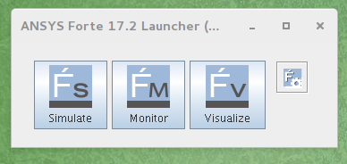
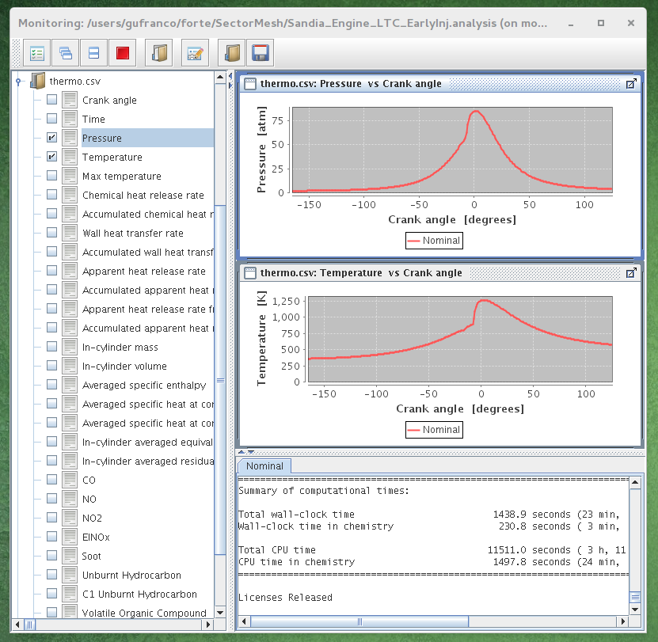
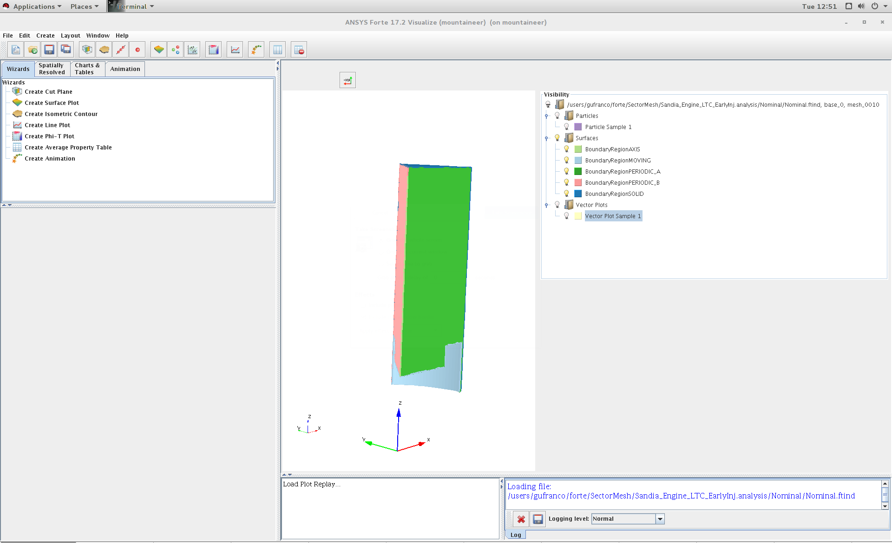

Engineering: ANSYS/Forte
========================

Overview
--------

ANSYS Forte is the only CFD simulation package for internal combustion
engines that incorporates proven ANSYS Chemkin-Pro solver technology –
the gold standard for modeling and simulating gas phase and surface
chemistry. Forte includes state-of-the-art automatic mesh generation
(AMG), including solution adaptive mesh Refinement (SAM) and
geometry-based adaptive mesh refinement (AMR). While legacy
engine-combustion CFD simulations utilize chemistry solvers that are too
slow to handle the chemistry details required for accurate predictions
of ignition and emissions, Forte enables the use of multicomponent fuel
models to combine with comprehensive spray dynamics – without
sacrificing simulation time-to-solution.

Features
--------

-  Automatic mesh generation that eliminates weeks of effort typically
   spent on manual mesh preparation
-  Embedded Chemkin-Pro solver technology that provides the
   computational speed required for predictive engine simulations
-  True multicomponent fuel-vaporization models that enable a
   self-consistent representation of the physical spray and the kinetics
   for accurate prediction of fuel effects
-  Advanced spray models that dramatically reduce grid and time-step
   dependency when compared to existing approaches
-  The ability to track soot particle nucleation, growth, agglomeration
   and oxidation without a compute-time penalty to predict particle size
   and number

Tutorial
--------

This tutorial will describe the steps needed to complete the execution
of the first examples from the tutorial documentation.

Connect to Mountaineer
~~~~~~~~~~~~~~~~~~~~~~

::

     ssh -X username@mountaineer.hpc.wvu.edu

The \`-X\` is necessary to get access to the graphical interface needed
to prepare the simulation.

Load the Module
~~~~~~~~~~~~~~~

::

    module load ansys/forte/17.2

Forte initial GUI

Execute the ANSYS/Forte GUI
~~~~~~~~~~~~~~~~~~~~~~~~~~~

First, we need to create a directory for the simulation we want to
perform. Lets create for example a directory called 'forte' and inside
create a subdirectory for our first simulation. The first simulation
will be 'SectorMesh'

::

     mkdir $HOME/forte
     mkdir $HOME/forte/SectorMesh

The Official Tutorials for Forte are in
'/software/ansys\_central/Forte\_Tutorials', we will copy
Sandia\_Engine\_LTC\_EarlyInj.ftsim to the directory we just create.

::

     cp /software/ansys_central/Forte_Tutorials/Quick-start_SectorMesh/Sandia_Engine_LTC_EarlyInj.ftsim $HOME/forte/SectorMesh

We will use this input for this tutorial, now, we can launch the GUI
using the command:

::

     forte.sh &

The '&' will free your terminal so you can enter more commands there.
Otherwise you will need another terminal when we actually launch the
simulation. Once you execute 'forte.sh' you should get a window with 3
buttons: Simulate, Monitor and Visualize.

.. figure:: ../_static/mod_forte_2.png
   :alt: Simulate Window

Simulate Window

Click on Simulate button and open the file
\`Sandia\_Engine\_LTC\_EarlyInj.ftsim\` You should get the 'Simulate'
window. Click on Menu 'File - Open...' and search for the input file
'Sandia\_Engine\_LTC\_EarlyInj.ftsim', in your directory
'forte/SectorMesh'. The main window will display the mesh, you get on
the log panel messages such

::

     Loading fuel library...
     Fuel library successfully loaded from
        /array/software/ansys_central/v172/install/ansys_inc/v172/reaction/forte.linuxx8664/data/fuel_library.cks
     Initializing
     Initializing

Now we are ready to create the scripts and run the simulation on
Mountaineer

.. figure:: ../_static/mod_forte_3.png
   :alt: Simulate Window

Simulate Window

Prepare simulation files
~~~~~~~~~~~~~~~~~~~~~~~~

Click on "Run Simulation" in the tree panel. The options for runnig the
simulation appear in a panel down the tree panel. There are several
options that we need to change. Select Parallel instead of Serial.
Change to 'Prepare Batch Scripts Only'. There is also a field under 'MPI
Args', change that to the number of cores that you want use. 8 could be
a reasonable number for this small simulation. Click the Green triangle
under 'Prepare'.

Now, we need to go back to the terminal and see the effects of preparing
the simulation runs. A new directory is created called
'Sandia\_Engine\_LTC\_EarlyInj.analysis'. Inside that directory there
are one file called 'Sandia\_Engine\_LTC\_EarlyInj.ftsim' and a
directory called 'Nominal' The contents of Nominal are:

::

     chem.inp
     chem.out
     fuel_lib_chem.inp
     fuel_lib_chem.out
     fuel_lib_gas.asc
     fuel_lib_xml.out
     gas.asc
     PREPARED
     run_env.bat
     run_env.sh
     run_mpi.bat
     run_mpi.sh
     Sandia_Engine_LTC_EarlyInj.ftsim
     therm.dat
     xml.out

Now, we need to prepare the submission script for Mountaineer Go to
'Nominal' directory and create the script file

::

    cd $HOME/forte/SectorMesh/Sandia_Engine_LTC_EarlyInj.analysis/Nominal
    cat <<EOF >runjob.pbs
    #!/bin/sh

    #PBS -N FORTE
    #PBS -l nodes=1:ppn=8,walltime=01:00:00
    #PBS -m ae
    ##PBS -M username@mail.wvu.edu
    #PBS -q hour

    module load ansys/forte/17.2

    cd $PBS_O_WORKDIR
    sh run_mpi.sh
    EOF

You should remove one ``#`` from ``##PBS -M username@mail.wvu.edu`` and
change the email address in order to receive notifications when job
finish. We are requesting 1 hour (walltime=01:00:00), using one node
(nodes=1) and creating 8 MPI processes (ppn=8). Those values should be
adapted to the needs of your job. If you ask for more than one hour you
must change also the queue where you are submiting the jobs (#PBS -q
hour), consider for example queues 'day' and 'week' if your jobs need
more time to complete.

Submit the job with

::

    qsub runjob.pbs

The job is submitted to the queue, it will start running when enough
resources are free to start executing your job. You can always monitor
the status of your submission with

::

    qstat -u username

Once your job simulation start execution, you can monitor the progress
by looking at the MONITOR file, one way of doing that is using tail
command.

::

    tail -f MONITOR

You should see something like

::

      7852    116.38  3.908E-02  5.000E-06  Maximum reached       953.80   330.53    0.4565  9.79E+00      15729       190
      7853    116.42  3.909E-02  5.000E-06  Maximum reached       953.70   330.51    0.4563  9.79E+00      15729       191
      7854    116.45  3.909E-02  5.000E-06  Maximum reached       953.60   330.49    0.4556  9.78E+00      15729       194
      7855    116.49  3.910E-02  5.000E-06  Maximum reached       953.50   330.48    0.4557  9.78E+00      15729       191
      7856    116.52  3.910E-02  5.000E-06  Maximum reached       953.41   330.46    0.4560  9.78E+00      15729       190
      7857    116.56  3.911E-02  5.000E-06  Maximum reached       953.31   330.44    0.4557  9.78E+00      15729       190
      7858    116.60  3.911E-02  5.000E-06  Maximum reached       953.21   330.42    0.4549  9.77E+00      15729       188
      7859    116.63  3.912E-02  5.000E-06  Maximum reached       953.12   330.41    0.4552  9.77E+00      15729       188

    Cycle#   CA[deg]    Time[s]    Step[s]  Step constraint      MaxT[K]  MinT[K] MaxP[MPa] MaxV[m/s]     #Cells #Clusters
      7860    116.67  3.912E-02  5.000E-06  Maximum reached       953.02   330.38    0.4550  9.77E+00      15729       188
      7861    116.70  3.913E-02  5.000E-06  Maximum reached       952.92   330.37    0.4551  9.76E+00      15729       188
      7862    116.74  3.913E-02  5.000E-06  Maximum reached       952.82   330.35    0.4542  9.76E+00      15729       185
      7863    116.78  3.914E-02  5.000E-06  Maximum reached       952.72   330.33    0.4542  9.76E+00      15729       187
      7864    116.81  3.914E-02  5.000E-06  Maximum reached       952.63   330.32    0.4544  9.76E+00      15729       188
      7865    116.85  3.915E-02  5.000E-06  Maximum reached       952.53   330.29    0.4541  9.75E+00      15729       186
      7866    116.88  3.915E-02  5.000E-06  Maximum reached       952.43   330.28    0.4535  9.75E+00      15729       186
      7867    116.92  3.916E-02  5.000E-06  Maximum reached       952.33   330.26    0.4534  9.75E+00      15729       188
      7868    116.96  3.916E-02  5.000E-06  Maximum reached       952.23   330.25    0.4534  9.74E+00      15729       186
      7869    116.99  3.917E-02  5.000E-06  Maximum reached       952.13   330.23    0.4538  9.74E+00      15729       187

    Cycle#   CA[deg]    Time[s]    Step[s]  Step constraint      MaxT[K]  MinT[K] MaxP[MPa] MaxV[m/s]     #Cells #Clusters
      7870    117.03  3.917E-02  5.000E-06  Maximum reached       952.03   330.21    0.4535  9.74E+00      15729       189
      7871    117.06  3.918E-02  5.000E-06  Maximum reached       951.93   330.19    0.4527  9.74E+00      15729       192
      7872    117.10  3.918E-02  5.000E-06  Maximum reached       951.83   330.18    0.4528  9.73E+00      15729       192
      7873    117.14  3.919E-02  5.000E-06  Maximum reached       951.73   330.16    0.4530  9.73E+00      15729       192

The screen will update when the execution advances. When simulation
finishes you should get a summary of execution like

::

    ============================================================
    Engine Summary Data:
    ------------------------------------------------------------
                    Cylinder Index                 1
    ------------------------------------------------------------
                             Power           9.84048  [kW]
                              IMEP           0.42126  [MPa]
                         Fuel Mass      5.35000E-002  [g/cyc]
          Fuel Lower Heating Value          44.52000  [kJ/g]
                        Gross ISFC         195.72213  [g/kW-h]
                    ISFC(IVC->EVO)         223.19199  [g/kW-h]
       Total Chemical Heat Release        2376.63829  [J]
       Total Heat Release From P-V        1297.21755  [J]
             Combustion Efficiency           0.99782  []
                Thermal Efficiency           0.41315  []
                      Max Pressure           8.62842  [MPa]
                   Max Temperature        1262.21947  [K]
            Max Pressure Rise Rate           0.84582  [MPa/deg]
             CA @  2% Heat Release         -14.97600  [deg ATDC]
             CA @ 10% Heat Release          -8.99000  [deg ATDC]
             CA @ 30% Heat Release          -5.98561  [deg ATDC]
             CA @ 50% Heat Release          -5.98561  [deg ATDC]
             CA @ 90% Heat Release           0.02813  [deg ATDC]
     10%-90% Heat Release Duration           9.01813  [deg]
                        Soot @ EVO      3.66015E-004  [g/kg-f]
                                        7.16372E-005  [g/kW-h]
                                        8.72851E-006  [ppm]
                       EINOx @ EVO      3.39138E+000  [g/kg-f]
                                        6.63767E-001  [g/kW-h]
                                        2.09039E+001  [ppm]
                          CO @ EVO      2.17074E+001  [g/kg-f]
                                        4.24862E+000  [g/kW-h]
                                        2.19759E+002  [ppm]
                         UHC @ EVO      1.30878E+001  [g/kg-f]
                                        2.56157E+000  [g/kW-h]
                      C1-UHC @ EVO      2.59096E+002  [ppm]
                         VOC @ EVO      1.35866E+001  [g/kg-f]
                                        2.65920E+000  [g/kW-h]
                      C1-VOC @ EVO      2.63832E+002  [ppm]

    ============================================================

    Normal termination:  Cycle# 8092, CrankAngle[deg]   125.00, Time[s]  4.0278E-02
    CGNS solution file closed successfully

    ================================================================================
    Summary of computational times:

    Total wall-clock time                         1438.9 seconds (23 min,   58.9 sec)
    Wall-clock time in chemistry                   230.8 seconds ( 3 min,   50.8 sec)

    Total CPU time                               11511.0 seconds ( 3 h, 11 min,   51.0 sec)
    CPU time in chemistry                         1497.8 seconds (24 min,   57.8 sec)
    ================================================================================

    Licenses Released

Many files are now on you Nominal directory.

::

    chem_0      chemsolver.csv        fuel_library_diag_0  gas.asc
    chem_0.out  COMPLETE              fuel_library_diag_1  massfraction.csv
    chem_1      dynamic.csv           fuel_library_diag_2  memory_diagnostics.csv
    chem_1.out  flow_diagnostics.csv  fuel_library_diag_3  molefraction.csv
    chem_2      FORTE.e107840         fuel_library_diag_4  MONITOR
    chem_2.out  FORTE.log             fuel_library_diag_5  nc14h30_fueltable.csv
    chem_3      FORTE.o107840         fuel_library_diag_6  Nominal_CA_p_125.00_8092.ftrst
    chem_3.out  fuelchem_0            fuel_library_diag_7  Nominal.ftavg
    chem_4      fuelchem_0.out        fuel_lib_xml.out     Nominal.ftind
    chem_4.out  fuelchem_1            fueltable.out        Nominal.ftres
    chem_5      fuelchem_1.out        fueltran_0           run_env.bat
    chem_5.out  fuelchem_2            fueltran_0.out       run_env.sh
    chem_6      fuelchem_2.out        fueltran_1           runjob.pbs
    chem_6.out  fuelchem_3            fueltran_1.out       runjob.pbs~
    chem_7      fuelchem_3.out        fueltran_2           run_mpi.bat
    chem_7.out  fuelchem_4            fueltran_2.out       run_mpi.sh
    chemdiag_0  fuelchem_4.out        fueltran_3           Sandia_Engine_LTC_EarlyInj.ftsim
    chemdiag_1  fuelchem_5            fueltran_3.out       speciesmass.csv
    chemdiag_2  fuelchem_5.out        fueltran_4           spray.csv
    chemdiag_3  fuelchem_6            fueltran_4.out       therm.dat
    chemdiag_4  fuelchem_6.out        fueltran_5           thermo.csv
    chemdiag_5  fuelchem_7            fueltran_5.out       wall_heat_transfer.csv
    chemdiag_6  fuelchem_7.out        fueltran_6           whole_domain_parameters.csv
    chemdiag_7  fuel_lib_chem.inp     fueltran_6.out       xml.out
    chem.inp    fuel_lib_chem.out     fueltran_7
    chem.out    fuel_lib_gas.asc      fueltran_7.out

The best way of continue from here is to copy those files back to your
workstation for post-processing and analysis.

You can however continue on Mountaineer and start analysing the results
of the simulation. On the initial window with three buttons, click on
Monitor and open the project file. The image on the left, you can get
see basic plots of temperature and pressure as a function of crank
angle. By clicking on the Visualize button you get a big window where
you can see visualizations of the fluids inside the crank.

|Monitor Window| |Visualize Window|

asdsadsd
